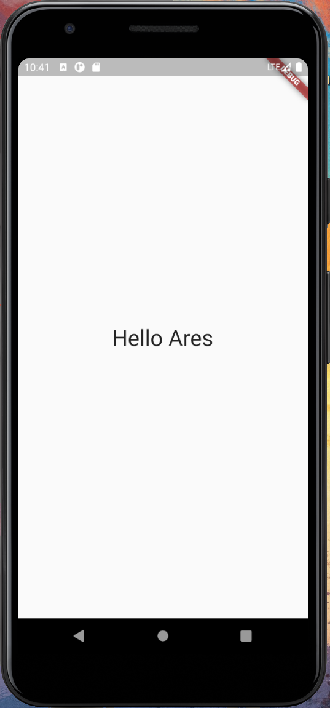

# Flutter Rust FFI Template on Windows

This project focuses on cross-compiling Rust to Android on **Windows**, if you are looking for the similar thing on UNIX platform, [this one](https://github.com/brickpop/flutter-rust-ffi) might be helpful.

## Prerequisites
* Windows 10 (Not tested on 8, 7, ...)
* Install [Visual Studio](https://visualstudio.microsoft.com/) with C++ development support.
* Install [LLVM](https://releases.llvm.org/download.html) 9 or higher.
* Android SDK and NDK installed.
* Flutter >= 2.0.5
* Rust >= 1.45.0

## Getting started

### Generate our project

Create a blank flutter project by:
```shell
$ flutter create greeter
$ cd greeter
$ dart migrate --apply-changes
```

Replace the newly generated `pubspec.yaml` as follows:
```yaml
name: greeter
description: A new Flutter project.

publish_to: 'none'

version: 1.0.0+1

environment:
  sdk: ">=2.12.0 <3.0.0"

dependencies:
  flutter:
    sdk: flutter
  cupertino_icons: ^1.0.2
  ffi: ^1.0.0

dev_dependencies:
  flutter_test:
    sdk: flutter
  ffigen: ^2.4.2

flutter:

  uses-material-design: true

ffigen:
  output: lib/bindings.dart
  headers:
    entry-points:
      - rust/target/bindings.h
  name: GreeterBindings
  description: Dart bindings to call rust functions
```

Create a rust project **under** this flutter project:
```shell
$ cargo new --lib --name greeter rust
```

Edit the newly generated rust/Cargo.toml file and add the `[lib]` section as follows:
```toml
[package]
name = "greeter"
version = "0.1.0"
edition = "2018"

[lib]
name = "greeter"
crate-type = ["cdylib"]

[dependencies]
```

Our target will be a shared library for Android.

### Write our native code
`rust/src/lib.rs`:
```rust
use std::os::raw::c_char;
use std::ffi::{CString, CStr};

#[no_mangle]
pub extern fn rust_greeting(to: *const c_char) -> *mut c_char {
    let c_str = unsafe { CStr::from_ptr(to) };
    let recipient = match c_str.to_str() {
        Err(_) => "there",
        Ok(string) => string,
    };

    CString::new("Hello ".to_owned() + recipient).unwrap().into_raw()
}

#[no_mangle]
pub extern fn rust_cstr_free(s: *mut c_char) {
    unsafe {
        if s.is_null() { return }
        CString::from_raw(s)
    };
}
```
### Compile the library
* Ensure that the env variable `ANDROID_NDK_HOME` points to the NDK base folder:
  * For me, I installed Android NDK by Android Studio, so mine is `C:\Users\Ares\AppData\Local\Android\Sdk\ndk\22.1.7171670`
* Install Rust targets and `cbindgen`:
  * `rustup target add aarch64-linux-android armv7-linux-androideabi i686-linux-android x86_64-linux-android`
  * `cargo install cbindgen`
* On the `rust` folder:
  * Execute the `build_android.ps1` **under the rust folder** to finish the remaining work

### Final step
Use the generated `GreetingBindings` class. An example wrapper is available [here](lib/greeter.dart).
If you modify your Rust code, just execute `build_android.ps1` again. 


